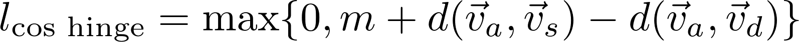

# Acoustic word embeddings using gated CNN

Jihang Zhang

## Overview

This is a PyTorch implementation of acoustic word embeddings using gated convolutional neural networks for a subset of Switchboard. The models map spoken words onto high-dimensional real space. A gated CNN classifier and a Siamese network are included. Average precision of the *same-different* task used to evaluate the models is the same as the criterion used in [Kamper et al., 2016](https://arxiv.org/abs/1510.01032), [Settle & Livescu, 2016](https://arxiv.org/abs/1611.02550) and [He et al., 2017](https://arxiv.org/abs/1611.04496)

### Gating mechanism

Instead of ReLU activation function after each convolution/fully-connected layer, the following gated tanh unit (GTU) is used:

<p align="center">
    
</p>

GTU is initially proposed by [Oord et al., 2016](http://papers.nips.cc/paper/6527-conditional-image-generation-with-pixelcnn-decoders) and thoroughly discussed by [Dauphin et al., 2016](https://arxiv.org/abs/1612.08083)

### Gated CNN classifier

The model trains supervised neural networks to classify each speech segment. The output of the final softmax layer can be seen as a representation of spoken words in v-dimensional real space, where v is the number of distinct word classes in training set (vocabulary size).

### Siamese networks

The model trains with a triplet margin loss:

<p align="center">
    
</p>

The output from the final linear layer can be seen as a representation of spoken words in 1024-dimensional real space as default.

## Dependencies

- Python 3.6
- NumPy 1.14
- PyTorch  0.4
- SciPy 1.1
- Kaldi
- CUDA Toolkit 9.0

## Contents

check_points_Gated_CNN/

- directory of saving models trained with gated CNN classifier

check_points_Siamese/

- directory of saving models trained with Siamese network

code/

- python code to create, run and save the models

data/

- directory of datasets

## Usage

1. Install all dependencies (above)

2. Clone [recipe_swbd_wordembeds](https://github.com/kamperh/recipe_swbd_wordembeds) by Kamper:

   ```bash
   $ git clone https://github.com/kamperh/recipe_swbd_wordembeds.git
   ```

3. Follow step 2, step 3 and **Data Preparation** in step 4 in [recipe_swbd_wordembeds](https://github.com/kamperh/recipe_swbd_wordembeds) to obtain the following three files:

   ```bash
   swbd.train.npz
   swbd.dev.npz
   swbd.test.npz
   ```

4. Move the three files above to data/

5. Navigate to code/. To train, evaluate and save the gated CNN classifier, in terminal:

   ```bash
   $ python gcnn.py
   ```

   To train, evaluate and save the Siamese network, in terminal:

   ```bash
   $ python siamese.py
   ```

## Results

| Model                                                        | Dimension | Average Precision |
| ------------------------------------------------------------ | :-------: | :---------------: |
| Classifier CNN [Kamper +, 2016](https://arxiv.org/abs/1510.01032) |   1061    |       0.532       |
| Siamese CNN [Kamper +, 2016](https://arxiv.org/abs/1510.01032) |   1024    |       0.549       |
| Classifier LSTM [Settle & Livescu, 2016](https://arxiv.org/abs/1611.02550) |   1061    |       0.616       |
| Siamese LSTM [Settle & Livescu, 2016](https://arxiv.org/abs/1611.02550) |   1024    |       0.671       |
| Multi-view LSTM [He +, 2017](https://arxiv.org/abs/1611.04496) |   1024    |       0.806       |
| Classifier Gated CNN (my model)                              |   1061    |     **0.853**     |
| Siamese Gated CNN (my model)                                 |   1024    |     **0.756**     |

Our acoustic word embeddings using classifier gated CNN improves over previous approaches for the task of word discrimination.

### Visualization

Use t-SNE to visualize the embeddings.

#### classifier gated CNN:

<p align="center">
    
</p>

#### Siamese gated CNN:

<p align="center">
    
</p>

# Reference

- H. Kamper, W. Wang, and K. Livescu, “Deep convolutional acoustic word embeddings using word-pair side information,” in Acoustics, Speech and Signal Processing (ICASSP), 2016 and its [Repository](https://github.com/kamperh/recipe_swbd_wordembeds).
- S. Settle and K. Livescu, “Discriminative acoustic word embeddings: Tecurrent neural network-based approaches,” in Spoken Language Technology Workshop (SLT), 2016.
- W. He, W. Wang, and K. Livescu, “Multi-view recurrent neural acoustic word embeddings,” 2016.
- A. van den Oord, N. Kalchbrenner, L. Espeholt, O. Vinyals, A. Graves et al., “Conditional image generation with pixelcnn decoders,” in Advances in Neural Information Processing Systems, 2016.
- Y. N. Dauphin, A. Fan, M. Auli, and D. Grangier, “Language modeling with gated convolutional networks,” 2016.

